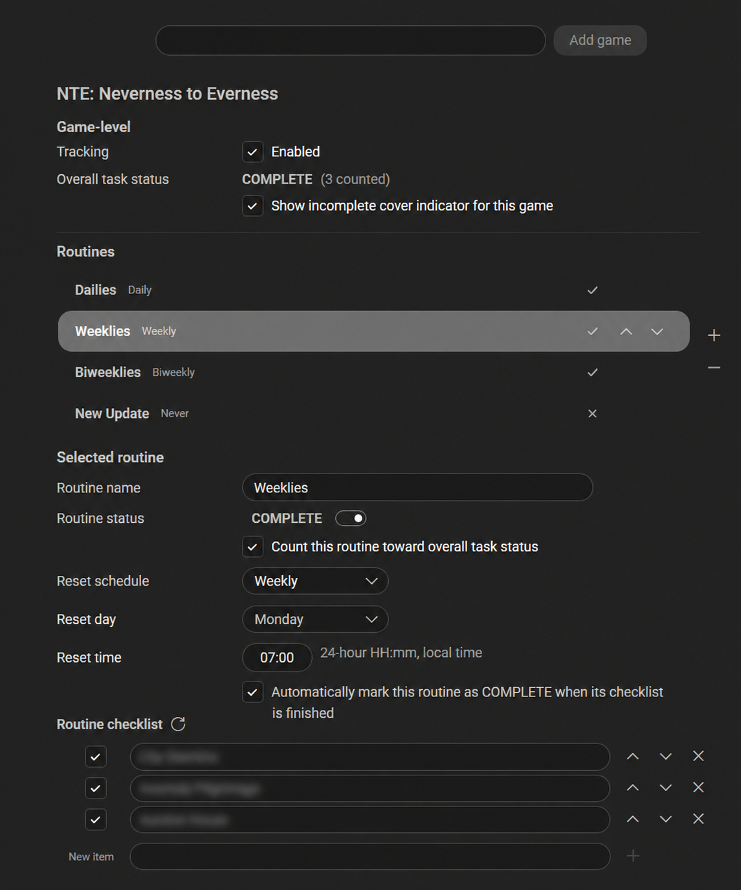
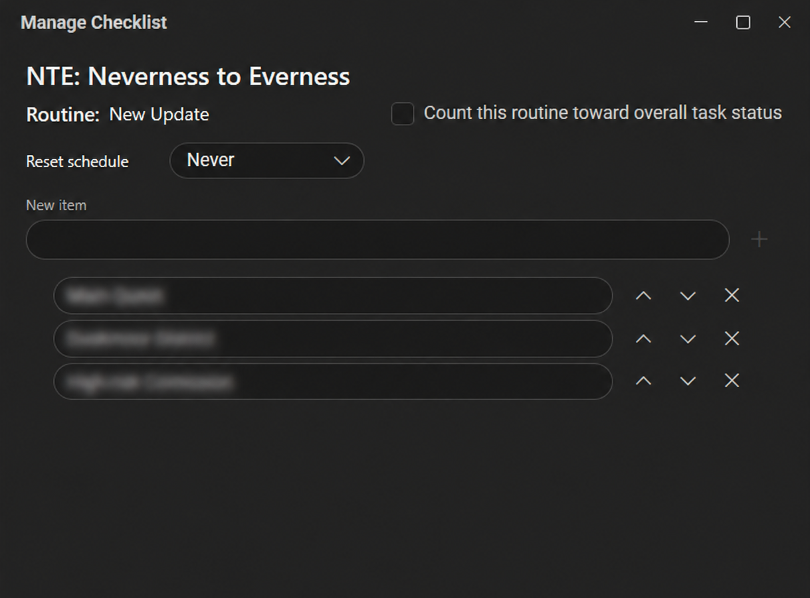
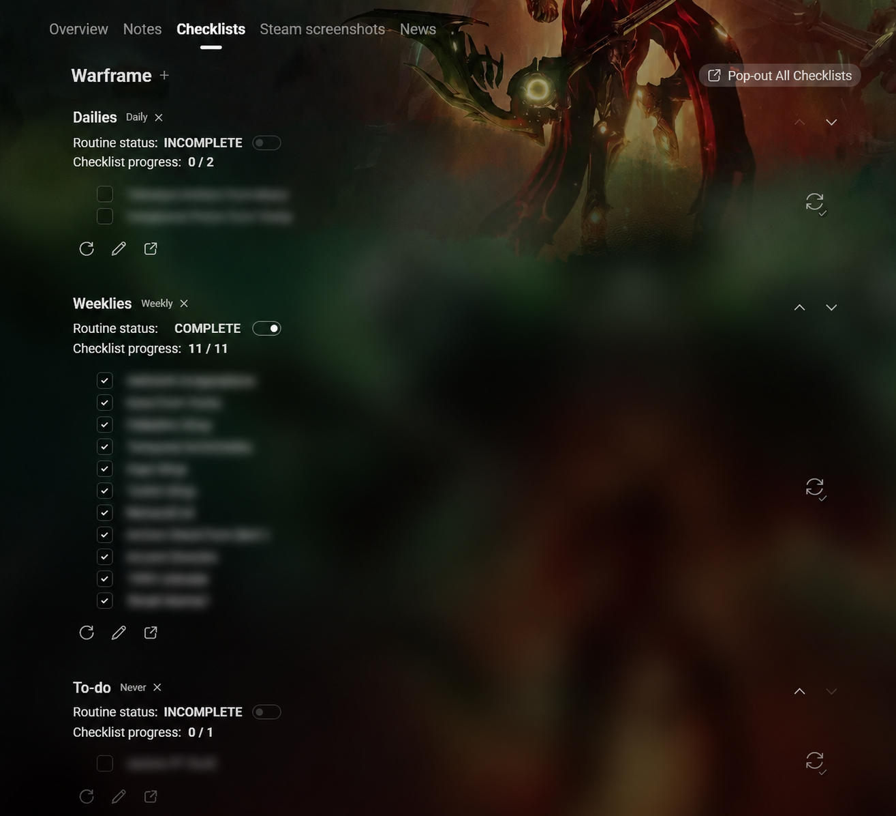
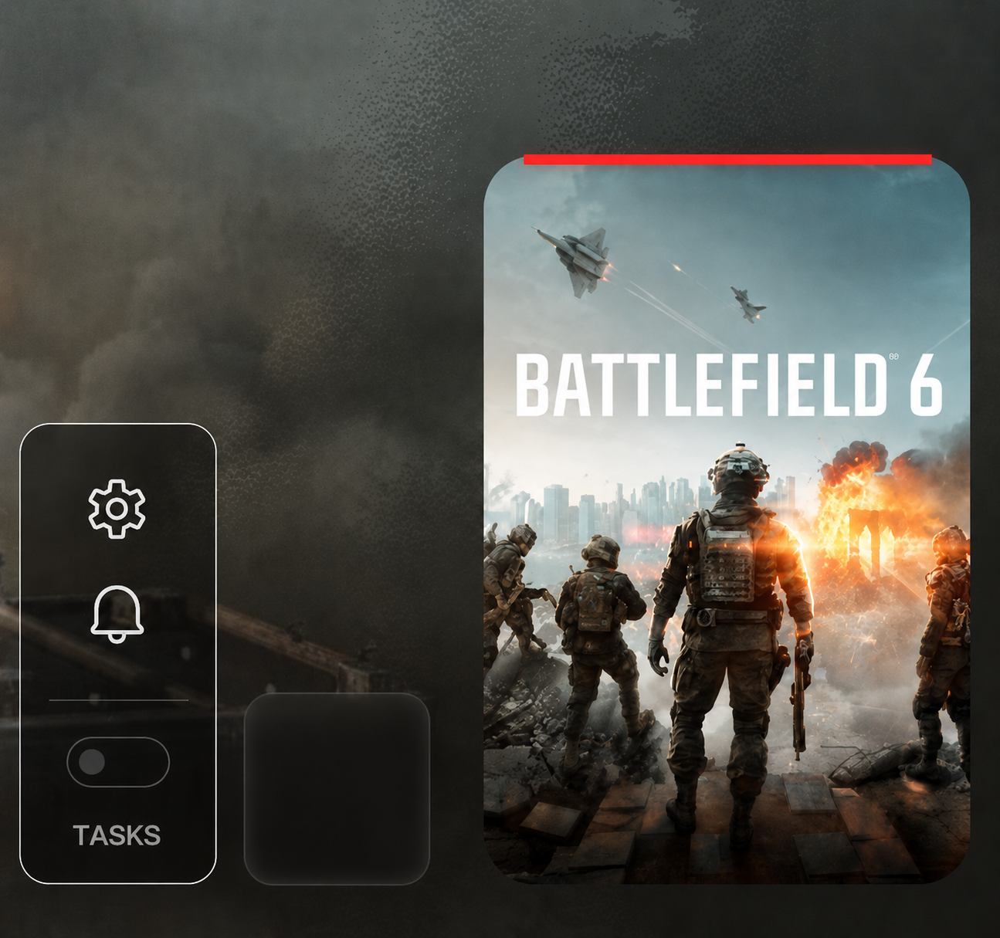
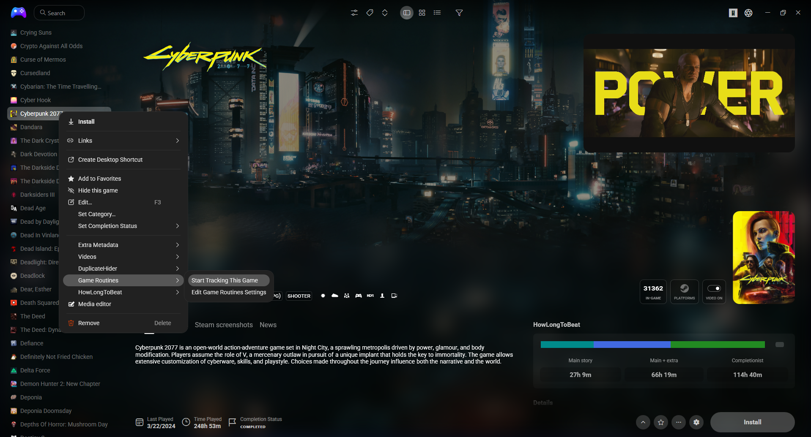

# Game Routines

Game Routines is a Playnite extension for managing recurring and long-term game activities with routines, checklists, reset schedules, and reminders.

Game Routines works with Playnite's Default theme. No third-party theme is required, although some themes can show optional Game Routines controls directly in the game view.

All screenshots were taken using the [FusionX](https://github.com/sakasakiking/FusionX) theme.

## Features

- Track games from Playnite's game context menu or the extension settings.
- Create and order multiple named routines for each game.
- Maintain an ordered checklist and **COMPLETE** / **INCOMPLETE** state for each routine.
- Automatically reset routine checklists on a set schedule: **Never**, **Daily**, **Weekly**, or **Biweekly**.
- Automatically derive a routine's state from its checklist.
- Choose which routines count toward the game's overall task status.
- Configure an independent game-level **Custom Reminder**.
- Receive persistent notifications through Playnite's internal notification system.
- Open checklists in separate pop-out windows while continuing to use Playnite.
- Use context-menu actions to open, complete, reset, and configure tracked tasks.
- Optionally have Game Routines automatically add or remove a `Tasks Available!` tag based on a game's overall task status.
- Some themes can show optional Game Routines controls directly in the game view.

## How it works

Each tracked game can have multiple routines, each with its own name, order, checklist, status, and reset settings. Their checklists can reset daily, weekly, biweekly, or never, allowing different activity cycles to coexist within the same game.

A routine can either count toward the game's overall task status or be excluded from it:

- No participating routines means the overall state is **COMPLETE**.
- If all participating routines are **COMPLETE**, the overall state is **COMPLETE**.
- If any participating routine is **INCOMPLETE**, the overall state is **INCOMPLETE**.

This setting keeps optional or long-term routines from affecting the game's main task status unless you want them to.

If automatic `Tasks Available!` tag management is enabled, the tag is added whenever a game's overall status is incomplete and removed once everything is complete. You can use the tag to filter your library and quickly find games that still have tasks left to do.

## Checklist reset schedules

- **Never** leaves the checklist unchanged until you update or reset it manually.
- **Daily** resets at the chosen local time each day.
- **Weekly** resets on the chosen day and local time each week.
- **Biweekly** resets once every two weeks. The **Start date** defines the 14-day cycle, and the checklist resets every 14 days from that date at the chosen local time.

If Playnite was not running at a scheduled reset time, Game Routines processes the latest missed reset after startup.

## Checklists and task status

Checklist items can be added, edited, ordered, checked, unchecked, and reset independently for every routine.

When automatic completion from checklist is enabled for a routine:

- all checklist items checked = **COMPLETE**;
- any unchecked item = **INCOMPLETE**; and
- an empty checklist = **COMPLETE**.

The checklist controls that routine's state while automatic completion is enabled.

Checklist management is available through **Open Checklist** and **Manage Checklist** context-menu actions and in separate windows that can remain open while you continue using Playnite.

## Custom Reminders

**Custom Reminder** is configured once per game and is independent of the checklist reset schedules configured for that game's routines. It can run **Daily**, **Weekly**, or **Biweekly**, with its own title, message, and schedule. Biweekly reminders also have a **Start date**.

Biweekly reminders follow a 14-day cycle from the selected start date at the chosen local time. A reminder only creates a notification. It does not reset checklists or change routine status.

## Notifications

Game Routines uses Playnite's internal notification system instead of external Windows notifications. Its notification records are saved so pending Game Routines notifications remain available even after a Playnite restart.

## Theme compatibility

Game Routines works with Playnite's standard Default theme. No third-party theme is required.

With the Default theme, you can use Game Routines through its settings, context-menu actions, checklist windows, reminders, and notifications. The Default theme does not include the optional embedded **Checklists** tab, embedded state controls, or incomplete cover indicator. Those extra controls are optional and are not needed to use Game Routines.

Some themes can show optional Game Routines controls directly in the game view. [FusionX](https://github.com/sakasakiking/FusionX) 2.1.1 was used as the reference integration during development, but the official FusionX theme does not currently include those extra controls.

### Optional theme-integration example

The screenshots below show the optional controls in the modified FusionX setup used during Game Routines development. These controls are not included in the official theme and are not required to use Game Routines.

## Installation

### Playnite Add-on Browser

Add-on Browser installation is pending acceptance into the Playnite Add-on Database.

### Manual installation

1. Download the `.pext` file from the [latest Game Routines release](https://github.com/felipeaucc/playnite-gameroutines-plugin/releases/latest).
2. Open it with Playnite.
3. Restart Playnite if requested.

The `.pext` installs Game Routines only. It does not require or modify a third-party theme.

## Updating

Until Game Routines is accepted into the Playnite Add-on Database, install updates manually from GitHub Releases. Normal add-on update notifications and installation through Playnite will become available after the database entry is accepted.

## Getting started

1. Install Game Routines and restart Playnite if requested.
2. Select a game and choose **Game Routines > Start Tracking This Game** from its context menu, or use **Add game** in the Game Routines settings page.
3. Configure one or more routines and arrange their order.
4. Add checklist items if desired.
5. Choose the checklist reset schedule, whether the routine counts toward overall task status, and whether its checklist controls automatic completion.
6. Optionally enable and configure the game-level **Custom Reminder**.
7. Use **Game Routines > Open Checklist** from the game context menu when a separate checklist window is useful.

## Theme developer integration

Game Routines exposes three custom UI elements that Playnite Desktop themes can host: the multi-routine checklist, overall-state toggle, and incomplete-state indicator. See [Theme integration](THEME_INTEGRATION.md) for the registered source and element names, hosting guidance, and behavior expectations.

The files under [`Integrations/FusionX/2.1.1/`](Integrations/FusionX/2.1.1/) provide an optional reference implementation for theme developers.

## Development and source

Source code, issue tracking, and development history are hosted in this repository. Contributions and bug reports are welcome.
